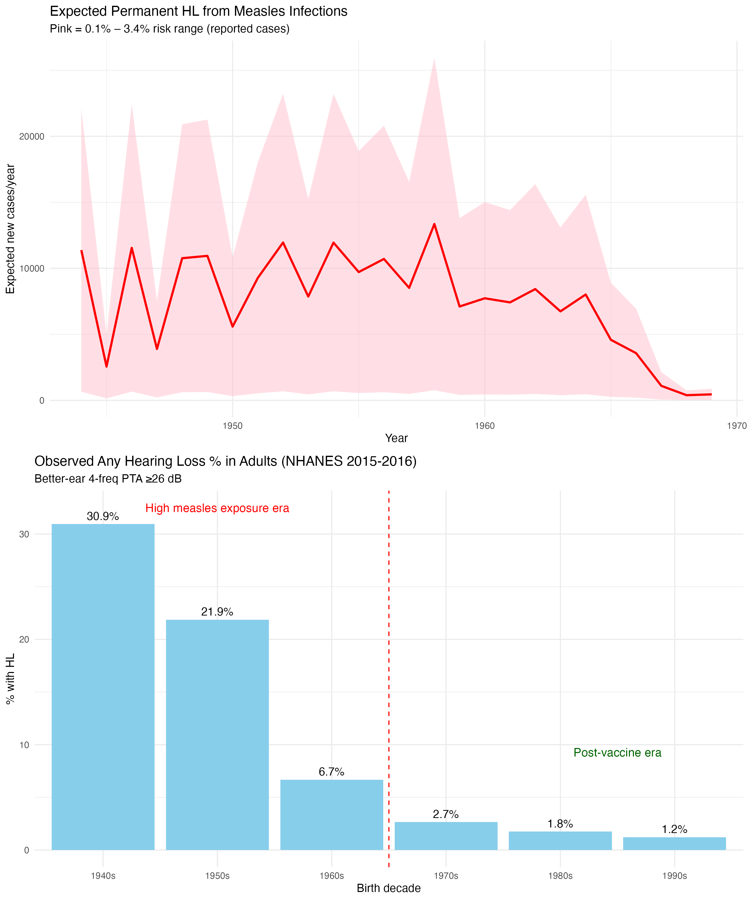

# Invisible Wedge: Measles-Related Permanent Hearing Loss

Reproducible R analysis showing systematic undercounting of measles-related permanent sensorineural hearing loss in U.S. national statistics due to broken etiologic linkage.

## Key Visual



- **Top panel** — Expected new permanent HL cases/year from measles (pink ribbon = 0.1%–3.4% risk range on reported cases; red line = midpoint ~1.75%). Peaks 1950s–early 1960s, drops post-vaccine.  
- **Bottom panel** — Observed any hearing loss % by birth decade from NHANES 2015–2016 (better-ear 4-freq PTA ≥26 dB). Elevated in pre-vaccine cohorts (30.9% 1940s → 21.9% 1950s) vs. post-vaccine (<3% 1980s+).

## Files

- `invisible_wedge_analysis.R` — full script (downloads NHANES live, computes everything, saves to "R shit" folder)

## How to Run

1. Install packages (once):
   ```r
   install.packages(c("tidyverse", "nhanesA", "ggplot2", "gridExtra", "scales"))Reproducible analysis showing undercounting of measles-related permanent hearing loss using NHANES &amp; historical CDC data
